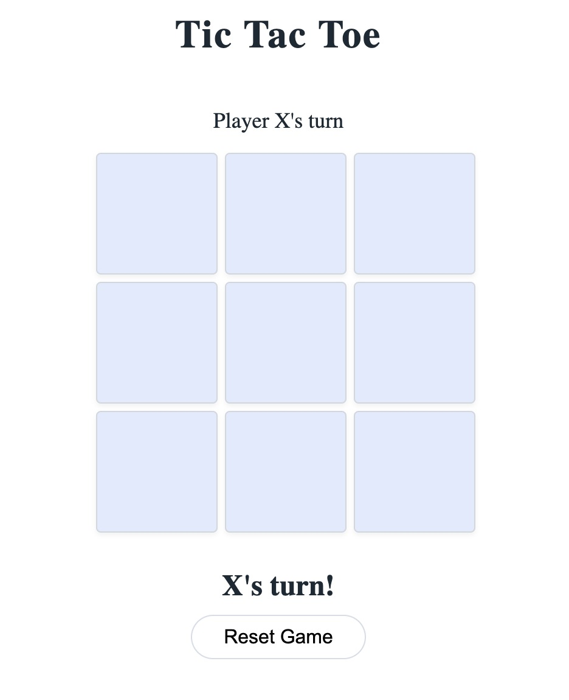
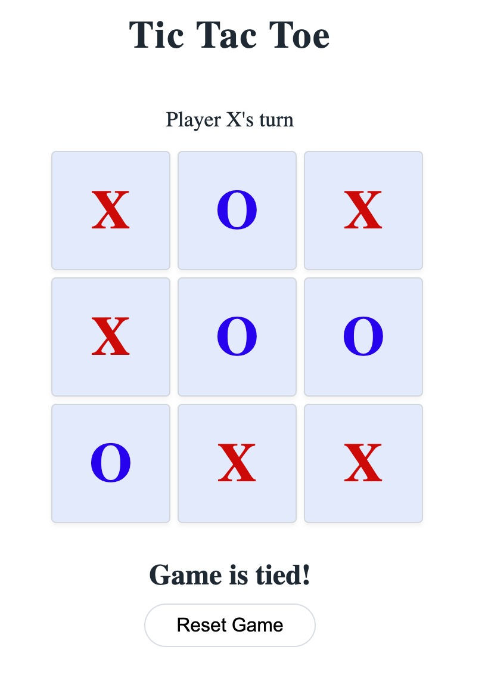
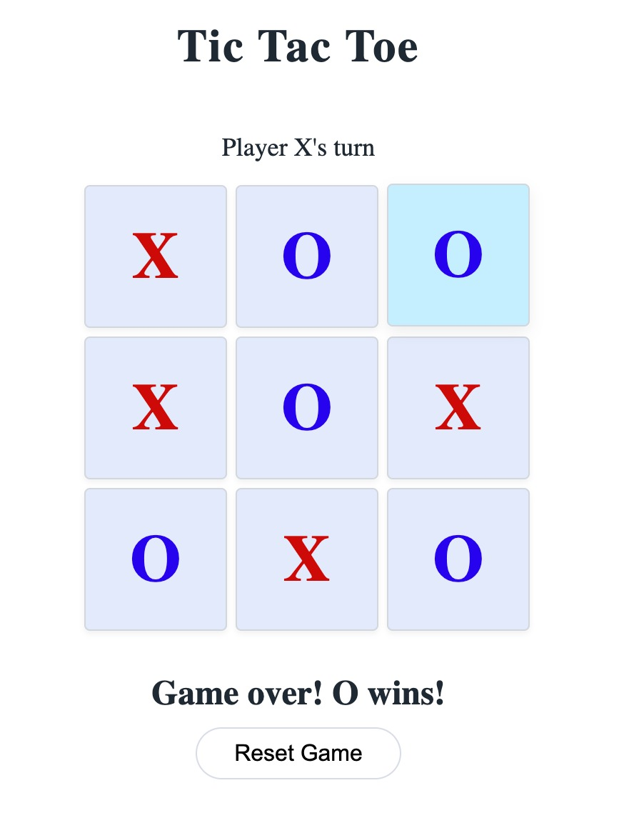

# Hackathon-28nov

# Tic Tac Toe

### What is Tic Tac Toe

Tic Tac Toe (also known as Noughts and Crosses) is a classic two-player strategy game. 
It is played on a 3 × 3 grid, and the goal is simple:

*Rules*

1. The game is played on a 3 × 3 grid.

2. There are two players:
- Player X
- Player O

3. Players take turns placing their symbol in any empty square.

4. Player X always goes first.

5. A player wins by getting three of their symbols in a row:
- horizontally
- vertically
- or diagonally

6. If all nine squares are filled and neither player has three in a row, the game ends in a tie.

7. Once a square is filled, it cannot be changed.

8. The game can be restarted at any time using the Reset Game button.

## Usage
- This application is meant to replicate the classic game Tic Tac Toe. 
- Both players take turns to click on squares where they wish to place their move. 
- The game ends when either player manages to connect 3 squares in a row on the 3x3 grid. 
- If no players win, the game ends when all squares are filled.

## Game Preview

Below are several screenshots showing how the game looks during different stages of play:

- Game Start: A clean 3×3 grid with Player X beginning the match.
- Tie Game: A full board with no winning line, displaying a message that the game has ended in a draw.
- O Wins: A completed board showing Player O’s winning line and the victory message.

These images help demonstrate the flow of the game and what players can expect while playing.

## Functions 

- endMessage (H2 Element Creation)
Creates a new (h2) element to show whose turn it is or who won the game.

- Click Event on Each Square
Listens for a click on each square and handles placing X or O, checking win/tie, and switching turns.

- winning_combinations
Stores all eight possible ways a player can win in Tic Tac Toe (rows, columns, diagonals).

- checkWin(currentPlayer)
Checks whether the current player has three matching symbols in any winning combination.

- checkTie()
Checks if the board is completely full and no player has won, meaning the game ends in a tie.

- restartButton()
Clears the board, removes winning highlights, and resets the game back to X’s turn.

- document.getElementById("resetBtn").addEventListener("click", restartButton)
Connects the Reset button in HTML so that clicking it restarts the game.
